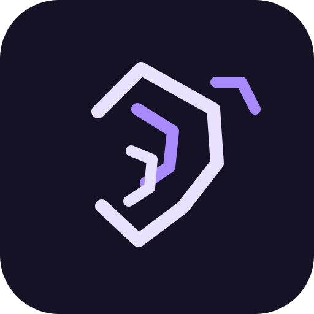

<p align="center">
  
</p>

<h1 align="center">Orpheus</h1>

<p align="center">
  A clean Flutter audio player focused on local music, playlists, device audio discovery, and a smooth player experience.
</p>

<p align="center">
  
  
  
  
  
  
  
</p>

---

## Creator

**Yahya Mansoub**

---

## Overview

Orpheus is a Flutter-based local audio player. It is designed around a modular architecture with separated app setup, models, services, controllers, screens, and widgets.

The app currently supports local audio imports, General Downloads/library management, playlist work, playback controls, a mini-player, a full player screen, and a Radar flow for device audio discovery.

---

## Features

### Audio Library

- Import audio files from the device.
- Store imported tracks locally.
- Prevent duplicate tracks.
- Keep added tracks after app restart.
- Handle missing or unavailable files gracefully.

### General Downloads

- View all audio files added to the app.
- Add more audio files using the floating `+` button.
- Tap a track to start playback.

### Player

- Mini-player with current track and progress.
- Full player screen.
- Play / pause support.
- Seek support.
- Previous / next controls.
- Queue-based playback.

### Radar

- Radar is the device-audio discovery area.
- Supports manual audio selection.
- Native Android MediaStore scanning can be wired through the app’s `orpheus/radar` MethodChannel.
- Uses Android audio permissions:
  - `READ_MEDIA_AUDIO` for Android 13+
  - `READ_EXTERNAL_STORAGE` for Android 12 and below

### Playlists

- Dedicated playlists area.
- Intended playlist support:
  - create playlists
  - add name
  - add description
  - add image
  - add tracks
  - play playlist tracks

### Navigation

- Home screen navigation hub.
- Drawer/sidebar navigation.
- Separate screens for Home, General Downloads, Radar, Playlists, and Player.

---

## Tech Stack

- **Flutter** for cross-platform UI.
- **Dart** for app logic.
- **Android / Kotlin** for native MediaStore access.
- **just_audio** for playback.
- **file_picker** for manual audio selection.
- **shared_preferences** for lightweight local persistence.
- **GitHub Actions** for CI checks.

---

## Project Structure

```text
lib/
  main.dart
  app/
    orpheus_app.dart
    app_routes.dart
  models/
    audio_track.dart
    playlist.dart
  services/
    audio_library_service.dart
    audio_player_service.dart
    permission_service.dart
    radar_service.dart
    playlist_service.dart
  controllers/
    library_controller.dart
    player_controller.dart
    playlist_controller.dart
  screens/
    home_screen.dart
    general_downloads_screen.dart
    radar_screen.dart
    playlists_screen.dart
    player_screen.dart
  widgets/
    app_drawer.dart
    empty_state.dart
    mini_player.dart
    player_controls.dart
    track_tile.dart
```

Some playlist files may be added as playlist development progresses.

---

## Requirements

Install:

- Flutter stable
- Dart SDK
- Android Studio
- Android SDK
- Android emulator or physical Android device

Check your setup:

```bash
flutter doctor
```

---

## Getting Started

Clone the repository:

```bash
git clone https://github.com/YOUR_USERNAME/Orpheus.git
cd Orpheus
```

Install dependencies:

```bash
flutter pub get
```

Run checks:

```bash
dart format .
flutter analyze
flutter test
```

Run on Android emulator:

```bash
flutter devices
flutter run -d emulator-5554
```

If your emulator has a different ID, use the ID shown by:

```bash
flutter devices
```

---

## Add Audio Files to Emulator

Push a song into the emulator:

```bash
adb push ~/Music/song.mp3 /sdcard/Music/song.mp3
```

Ask Android to index the file:

```bash
adb shell am broadcast \
  -a android.intent.action.MEDIA_SCANNER_SCAN_FILE \
  -d file:///sdcard/Music/song.mp3
```

Then open the app:

```text
Radar → Scan device
```

or manually:

```text
Radar → Select audio
```

---

## Useful Commands

Format:

```bash
dart format .
```

Analyze:

```bash
flutter analyze
```

Run tests:

```bash
flutter test
```

Run app:

```bash
flutter run -d emulator-5554
```

Build debug APK:

```bash
flutter build apk --debug
```

Clean project:

```bash
flutter clean
flutter pub get
```

---

## CI

The repository uses GitHub Actions for Flutter checks.

Recommended CI steps:

```text
flutter pub get
dart format --output=none --set-exit-if-changed .
flutter analyze
flutter test
flutter build apk --debug
```

---


## License

This project is licensed under the MIT License.

See the `LICENSE` file for details.
